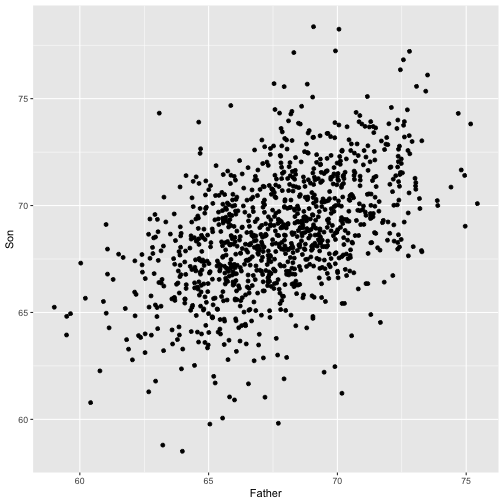

The complex inner life of simple regression
========================================================
author: Matthew Rudd
date: 17 November 2020
autosize: true

A famous example
========================================================
left: 50%

Heights of 1,078 fathers and sons

***

The simple linear regression model
========================================================

$y = \beta_{0} + \beta_{1}x + \epsilon$

The Gauss-Markov Theorem
========================================================

you know, OLS is BLUE and whatnot

Chebyshev's Theorem
========================================================

75% of observations are within 2 SDs -- no matter what!
